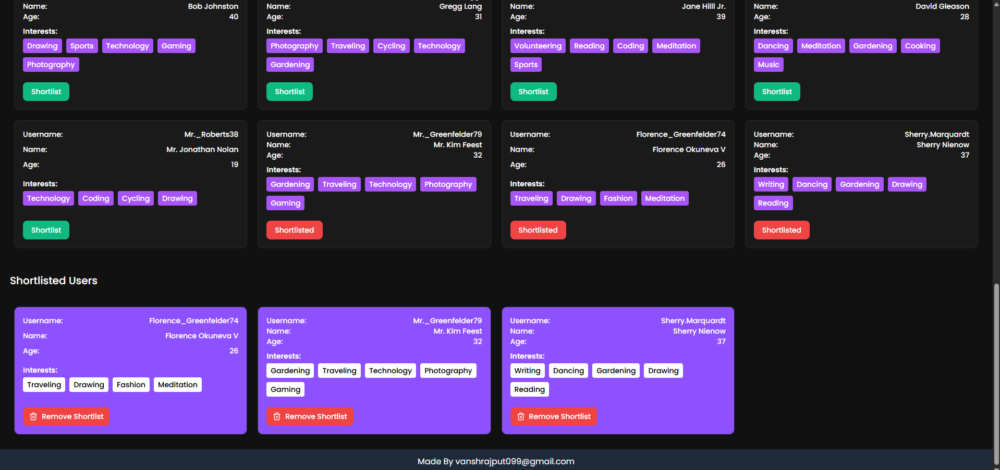

# 👥 Companion Matcher

A full-stack matchmaking web app built with **Next.js**, where users can sign up, log in, and discover other users with similar interests. The app allows real-time interest-based user matching, username search (case-sensitive), and user shortlisting.

Some of the pre existing username that you can search without creating an account - Julia31, Rudy45, Tammy9, Alfredo24.




## ✨ Features

- 🔐 **User Authentication** – Secure sign up and login flow
- 🤝 **Interest-Based Matching** – Automatically matches users with similar interests
- 🔍 **Username Search** – Search for users by username (case-sensitive)
- ⭐ **Shortlisting** – Save users you like to a shortlist
- 📱 **Responsive UI** – Mobile-first design using Tailwind CSS and shadcn/ui

## 🛠️ Tech Stack

- **Frontend:** Next.js, React, Tailwind CSS, shadcn/ui
- **Backend:** Next.js Server Actions
- **Database:** PostgreSQL
- **State Management:** React Hooks, Context API

## 🚀 Getting Started
### Prerequisites

- Node.js
- PostgreSQL - Supabase

### Clone and Install

```bash
git clone https://github.com/vanshrajput099/companion-matcher.git
cd companion-matcher
npm install
